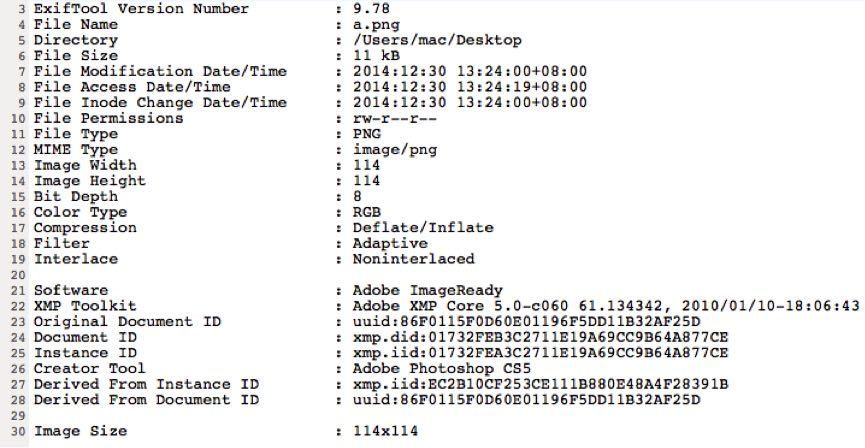
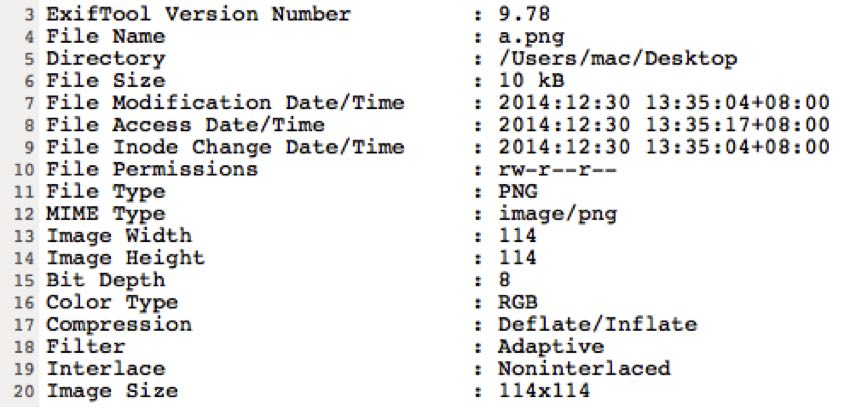
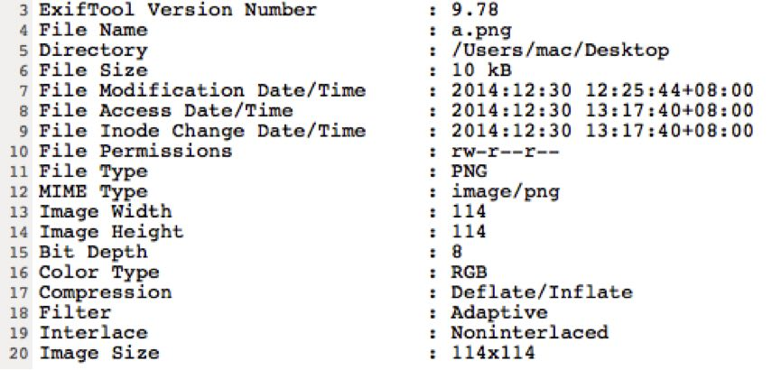

只对png图片处理，jpg的不处理。

Android打包会有如下信息：


[crunch] /work/dev/res/drawable-ldpi/welcome_words.png: libpng warning: iCCP: Not recognizing known sRGB profile that has been edited

Android打包会处理掉图片的medatdata信息

正常图片exif


apk解压出的图片exif



通过exiftool工具去除metadata信息


exiftool –overwrite [file] 或者 exiftool –overwrite –all= *


