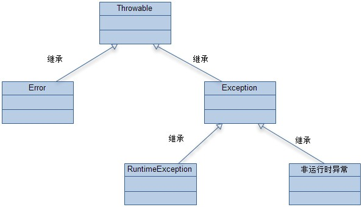

一、Java Exception体系

二、Java Reference体系

三、泛型（generics）简介

四、Executors java线程池

五、类加载器ClassLoader

六、序列化（Serialization）

一、Java Exception体系

Java Exception体系继承关系如下

通常来讲，Java中的异常会被分为三种：

Error: 这种异常被设计成不被捕获，因为这种异常产生于JVM自身。

Runtime Exception: 运行时异常往往与环境有关，编译时无法检查，并且可能发生的情况太广泛，所以系统会去处理，程序不需要捕获。

普通异常: 非运行时异常。

这里的Java异常指直接继承java.lang.Throwable的异常类：

普通的Exception必须被捕获，RuntimeException则不用

	package com.test;
	
	public class Test {
	
		public static void main(String[] args) {
			test();
		}
	
		public static void test() {
			throwError(); // 运行时阻断程序
			
			throwRuntimeException(); // 运行时阻断程序
			throwsRuntimeException(); // 运行时阻断程序
			
			throwException(); // 运行时不会阻断程序，内部不捕获的话编译不能过
			try {
				throwsException(); // 运行时不会阻断程序，不捕获的话编译不能过
			} catch (Exception e) {
				e.printStackTrace();
			}
		}
	
		// 自己和调用方都不需要必须处理
		public static void throwError() {
			throw new Error();
		}
	
		// 自己和调用方都不需要必须处理
		public static void throwRuntimeException() {
			throw new RuntimeException();
		}
	
		// 自己和调用方都不需要必须处理
		public static void throwsRuntimeException() throws RuntimeException {
			throw new RuntimeException();
		}
	
		// 必须throws或着自己捕获,自己捕获外层不会获取到
		public static void throwException() {
			try {
				throw new Exception();
			} catch (Exception e) {
				e.printStackTrace();
			}
		}
	
		// 必须throws或着自己捕获,throws出去的话外部必须捕获或者继续向上层throws
		public static void throwsException() throws Exception {
			throw new Exception();
		}
	}

二、Java Reference体系

Java Reference体系继承关系如下

在JDK 1.2以前的版本中，若一个对象不被任何变量引用，那么程序就无法再使用这个对象。也就是说，只有对象处于可触及（reachable）状态，程序才能使用它。从JDK 1.2版本开始，把对象的引用分为4种级别，从而使程序能更加灵活地控制对象的生命周期。这4种级别由高到低依次为：强引用、软引用、弱引用和虚引用。

1. 强引用（StrongReference）
强引用是使用最普遍的引用。如果一个对象具有强引用，那垃圾回收器绝不会回收它。当内存空间不足，Java虚拟机宁愿抛出OutOfMemoryError错误，使程序异常终止，也不会靠随意回收具有强引用的对象来解决内存不足的问题。

2. 软引用（SoftReference）
如果一个对象只具有软引用，则内存空间足够，垃圾回收器就不会回收它；如果内存空间不足了，就会回收这些对象的内存。只要垃圾回收器没有回收它，该对象就可以被程序使用。软引用可用来实现内存敏感的高速缓存。
软引用可以和一个引用队列（ReferenceQueue）联合使用，如果软引用所引用的对象被垃圾回收器回收，Java虚拟机就会把这个软引用加入到与之关联的引用队列中。

3. 弱引用（WeakReference）
弱引用与软引用的区别在于：只具有弱引用的对象拥有更短暂的生命周期。在垃圾回收器线程扫描它所管辖的内存区域的过程中，一旦发现了只具有弱引用的对象，不管当前内存空间足够与否，都会回收它的内存。不过，由于垃圾回收器是一个优先级很低的线程，因此不一定会很快发现那些只具有弱引用的对象。
弱引用可以和一个引用队列（ReferenceQueue）联合使用，如果弱引用所引用的对象被垃圾回收，Java虚拟机就会把这个弱引用加入到与之关联的引用队列中。

4. 虚引用（PhantomReference）
“虚引用”顾名思义，就是形同虚设，与其他几种引用都不同，虚引用并不会决定对象的生命周期。如果一个对象仅持有虚引用，那么它就和没有任何引用一样，在任何时候都可能被垃圾回收器回收。
虚引用主要用来跟踪对象被垃圾回收器回收的活动。虚引用与软引用和弱引用的一个区别在于：虚引用必须和引用队列 （ReferenceQueue）联合使用。当垃圾回收器准备回收一个对象时，如果发现它还有虚引用，就会在回收对象的内存之前，把这个虚引用加入到与之 关联的引用队列中。

ReferenceQueue queue = new ReferenceQueue ();  
PhantomReference pr = new PhantomReference (object, queue);  
程序可以通过判断引用队列中是否已经加入了虚引用，来了解被引用的对象是否将要被垃圾回收。如果程序发现某个虚引用已经被加入到引用队列，那么就可以在所引用的对象的内存被回收之前采取必要的行动。

三、泛型（generics）简介

在Java SE 1.5之前，没有泛型的情况的下，可以通过对类型使用Object的引用来实现参数的“任意化”，使用时需要显示的强制类型转换，这个动作必须是在开发者对实际参数类型可以预知的情况下进行，否则则会抛出“java.lang.ClassCastException”异常。

泛型是Java SE 1.5的新特性，泛型的本质是参数化类型，也就是说所操作的数据类型被指定为一个参数。这种参数类型可以用在类、接口和方法的创建中，分别称为泛型类、泛型接口、泛型方法。

	Java泛型中的标记符含义： 
	E - Element (在集合中使用，因为集合中存放的是元素)
	T - Type（Java 类）
	K - Key（键）
	V - Value（值）
	N - Number（数值类型）
	？ -  表示不确定的java类型
	S、U、V  - 2nd、3rd、4th types
	自定义泛型这些可以随便写，占位符的作用。
  
Object是所有类的根类，任何类的对象都可以设置给该Object引用变量，使用的时候可能需要类型强制转换，但是用使用了泛型T、E等这些标识符后，在实际用之前类型就已经确定了，不需要再进行类型强制转换。

	public class Generics<T>{ // 使用<T>来声明一个类型持有者名称，然后就可以把T当作一个类型代表来声明成员、参数和返回值类型。
		private T data;
		
		public Generics(T d){
			data = d;
		}
		
		public T GetData(){
			return data;
		}
	}
	
	public class Generics<A>{ // 当然占位符可以自定义:
		private A data;
		
		public Generics(A d){
			data = d;
		}
		
		public A GetData(){
			return data;
		}
	}
	
	// 使用
	Generics<String> mGenerics = new Generics<String>("aa");

	public String getData(){
		return 	mGenerics.GetData();
	}
	

四、Executors java线程池

Executors类里面提供了一些静态工厂，生成一些常用的线程池。

1. newSingleThreadExecutor 
创建一个单线程的线程池。这个线程池只有一个线程在工作，也就是相当于单线程串行执行所有任务。如果这个唯一的线程因为异常结束，那么会有一个新的线程来替代它。此线程池保证所有任务的执行顺序按照任务的提交顺序执行。

2. newFixedThreadPool 
创建固定大小的线程池。每次提交一个任务就创建一个线程，直到线程达到线程池的最大大小。线程池的大小一旦达到最大值就会保持不变，如果某个线程因为执行异常而结束，那么线程池会补充一个新线程。

3. newCachedThreadPool 
创建一个可缓存的线程池。如果线程池的大小超过了处理任务所需要的线程，
那么就会回收部分空闲（60秒不执行任务）的线程，当任务数增加时，此线程池又可以智能的添加新线程来处理任务。此线程池不会对线程池大小做限制，线程池大小完全依赖于操作系统（或者说JVM）能够创建的最大线程大小。

4. newScheduledThreadPool 
创建一个大小无限的线程池。此线程池支持定时以及周期性执行任务的需求。

五、类加载器ClassLoader

1.什么是类加载器？

在类加载阶段，有一步是“通过类的全限定名来获取描述此类的二进制字节流”，而所谓的类加载器就是实现这个功能的一个代码模块，这个动作是在Java虚拟机外部实现的，这样做可以让应用程序自己决定如何去获取所需要的类。

类加载器的作用：首先类加载器可以实现最本质的功能即类的加载动作。同时，它还能够结合java类本身来确定该类在Java虚拟机中的唯一性。用通俗的话来说就是：比较两个类是否相等，只有这两个类是由同一个类加载器加载才有意义。否则，即使这两个类是来源于同一个Class文件，只要加载它们的类加载器不同，那么这两个类必定不相等。

2.双亲委派模型

从虚拟机的角度来说，只存在两种不同的类加载器：一种是启动类加载器（Bootstrap ClassLoader），该类加载器使用C++语言实现，属于虚拟机自身的一部分。另外一种就是所有其它的类加载器，这些类加载器是由Java语言实现，独立于JVM外部，并且全部继承自抽象类java.lang.ClassLoader。

该模型要求除了顶层的启动类加载器外，其余的类加载器都应当有自己的父类加载器。子类加载器和父类加载器不是以继承（Inheritance）的关系来实现，而是通过组合（Composition）关系来复用父加载器的代码。双亲委派模型的工作过程为：如果一个类加载器收到了类加载的请求，它首先不会自己去尝试加载这个类，而是把这个请求委派给父类加载器去完成，每一个层次的加载器都是如此，因此所有的类加载请求都会传给顶层的启动类加载器，只有当父加载器反馈自己无法完成该加载请求（该加载器的搜索范围中没有找到对应的类）时，子加载器才会尝试自己去加载。使用这种模型来组织类加载器之间的关系的好处是Java类随着它的类加载器一起具备了一种带有优先级的层次关系。例如java.lang.Object类，无论哪个类加载器去加载该类，最终都是由启动类加载器进行加载，因此Object类在程序的各种类加载器环境中都是同一个类。否则的话，如果不使用该模型的话，如果用户自定义一个java.lang.Object类且存放在classpath中，那么系统中将会出现多个Object类，应用程序也会变得很混乱。如果我们自定义一个rt.jar中已有类的同名Java类，会发现JVM可以正常编译，但该类永远无法被加载运行。

六、序列化（Serialization）

Serialization（序列化）是一种将对象以一连串的字节描述的过程；反序列化deserialization是一种将这些字节重建成一个对象的过程。Java序列化API提供一种处理对象序列化的标准机制。

序列化算法一般会按步骤做如下事情：
将对象实例相关的类元数据输出。
递归地输出类的超类描述直到不再有超类。
类元数据完了以后，开始从最顶层的超类开始输出对象实例的实际数据值。
从上至下递归输出实例的数据

序列化文件里还会包含序列化的协议和版本等，具体字节分析可参考[http://www.java3z.com/cwbwebhome/article/article8/862.html](http://www.java3z.com/cwbwebhome/article/article8/862.html)

serialVersionUID

Java的序列化机制是通过在运行时判断类的serialVersionUID来验证版本一致性的。在进行反序列化时，JVM会把传来的字节流中的serialVersionUID与本地相应实体（类）的serialVersionUID进行比较，如果相同就认为是一致的，可以进行反序列化，否则就会出现序列化版本不一致的异常。

当实现java.io.Serializable接口的实体（类）没有显式地定义一个名为serialVersionUID，类型为long的变量时，Java序列化机制会根据编译的class(它通过类名，方法名等诸多因素经过计算而得，理论上是一一映射的关系，也就是唯一的)自动生成一个serialVersionUID作序列化版本比较用，这种情况下，如果class文件(类名,方法名等)没有发生变化()增加空格,换行,增加注释,等等),就算再编译多次,serialVersionUID也不会变化的。

如果我们不希望通过编译来强制划分软件版本，即实现序列化接口的实体能够兼容先前版本，未作更改的类，就需要显式地定义一个名为serialVersionUID，类型为long的变量，不修改这个变量值的序列化实体都可以相互进行串行化和反串行化。