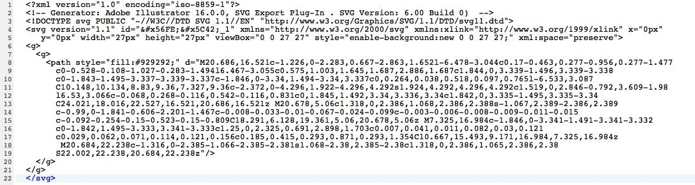
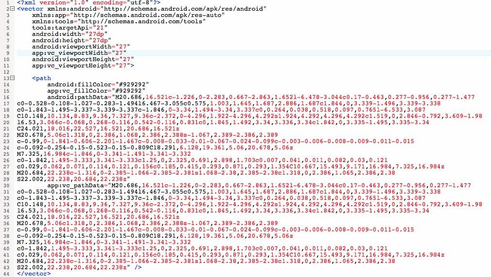

Android5.0后系统开始支持svg的解析，之前系统就需要使用兼容包

在线转换地址工具 [http://inloop.github.io/svg2android/](http://inloop.github.io/svg2android/) svg转换成Android可用svg

该转换工具对应5.0以下兼容库[vector-compat](https://github.com/wnafee/vector-compat)

教程[http://www.w3schools.com/svg/svg_path.asp](http://www.w3schools.com/svg/svg_path.asp)

按照Android m尺寸出svg，可以在之前布局的时候没有指定具体大小的情况下直接适配。如果代码里面都明确指定了图片view的大小，任意尺寸svg都行。

和普通SVG图内容不同地方在与viewBox那变成了viewportWidth，viewportHeight，viewport就相当于画这个SVG的画布大小。width和height是规定这个SVG图像最终的显示大小的，一般用dp表示。第二个不同是有一个普通SVG里的fill到android里要变成fillColor，这里就是SVG图像填充的颜色。第三点不同是，普通SVG的path的数据是d开头的标签，在android里要写成pathData。综上所述，只要把viewBox的大小改成viewport的大小，把填充颜色的fill改成fillColor，把Path中的d，改成pathData就行了。

还有最后一个问题pathData中的数字是在viewport中的坐标点，M代表move to（把画笔移动到），L是Line（划线），Z是封闭path.

svg文件内容

转换为Android可以识别的xml

这里有两个问题需要注意

1、其中多余的app:vc_fillColor和app:vc_pathData都是对原数据的copy，为的是在5.0以下的Android系统提供svg的解析，此方案会造成svg体积变大。可以把color和data分别放到values的svg_color.xml的svg_string.xml里面，通过key引用

	svg_color.xml
	<?xml version="1.0" encoding="utf-8"?>
	<resources>
		<color name="svg_fillColor">#929292</color>
	</resources>

	svg_string.xml
	<?xml version="1.0" encoding="utf-8"?>
	<resources>
		<string name="svg_pathData">。。。。。。。</string>
	</resources>
	
	svg.xml文件数据部分如下
	<path
        android:fillColor="@color/svg_fillColor"
        app:vc_fillColor="@color/svg_fillColor"
        android:pathData="@string/svg_pathData"
        app:vc_pathData="@string/svg_pathData" />
   	
2、5.0以下需要识别出那个是svg图片，那个是普通图片。针对svg图片需要使用VectorDrawable来解析，这就涉及到识别svg部分，目前就是简单的通过文件名的某些特殊标识来识别，但是如果更改文件名会造成需要修改原来资源使用的位置。简单的方案就是这个特殊标识加到后缀上，仿造系统的.9.png的格式，可以用.svg.xml的格式，这样就不需要更改原来代码的使用名称。