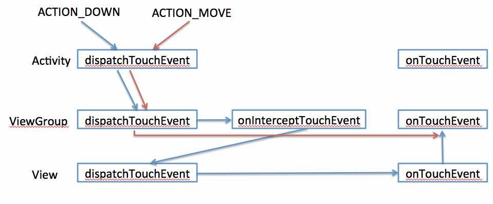

一、Android点击事件

二、Activity生命周期相关

一、Android点击事件
跟touch事件相关的3个方法：

	public boolean dispatchTouchEvent(MotionEvent ev);    //用来分派event
	public boolean onInterceptTouchEvent(MotionEvent ev); //用来拦截event
	public boolean onTouchEvent(MotionEvent ev);          //用来处理event
	
拥有这三个方法的类：

	Activity类：	Activity	
	dispatchTouchEvent(); 
	onTouchEvent();
	
	View容器（ViewGroup的子类）：FrameLayout、LinearLayout…… ListView、ScrollVIew……	
	dispatchTouchEvent();
	onInterceptTouchEvent();
	onTouchEvent();
	
	View控件（非ViewGroup子类）：Button、TextView、EditText…
	dispatchTouchEvent();
	onTouchEvent();
	
三个方法的用法：

	dispatchTouchEvent()	用来分派事件。
	其中调用了onInterceptTouchEvent()和onTouchEvent()，一般不重写该方法

	onInterceptTouchEvent()	用来拦截事件。
	ViewGroup类中的源码实现就是{return false;}表示不拦截该事件，
	事件将向下传递（传递给其子View）；
	若手动重写该方法，使其返回true则表示拦截，事件将终止向下传递，
	事件由当前ViewGroup类来处理，就是调用该类的onTouchEvent()方法

	onTouchEvent()	用来处理事件。
	返回true则表示该View能处理该事件，事件将终止向上传递（传递给其父View）；
	返回false表示不能处理，则把事件传递给其父View的onTouchEvent()方法来处理
	【注】：ViewGroup的某些子类（GridView、ScrollView...）重写了
	onInterceptTouchEvent()方法，当发生ACTION_MOVE事件时，返回true进行拦截。
	
具体示意图

viewgroup消耗了该事件，随后的action_move和up事件直接传给了该viewgroup

具体流程说明

	（1）这一系列的传递流程都是dispatchTouchEvent()方法来控制的，如果不人为地干预，事件将
	由上自下依次传递（因为默认是返回false不会拦截的），传递到最底层的View，就由它的、
	onTouchEvent()方法来处理事件，若处理成功返回true，若处理失败返回false，事件依次向上
	传递，每个View都调用自己的onTouchEvent()方法来处理事件，若处理成功就终止传递，若处理
	失败就继续向上传递。
	（2）经过人为的干预，若在向下传递的过程中被拦截了，即onInterceptTouchEvent()方法返回
	true，则事件将停止向下传递，直接由当前的onTouchEvent()方法来处理，若处理成功则OK，若
	处理不成功，则事件会向上传递。
	（3）另外，dispatchTouchEvent()方法中还有“记忆”的功能，如果第一次事件向下传递到某
	View，它把事件继续传递交给它的子View，它会记录该事件是否被它下面的View给处理成功了，
	（怎么能知道呢？如果该事件会再次被向上传递到我这里来由我的onTouchEvent()来处理，那就说
	明下面的View都没能成功处理该事件）；当第二次事件向下传递到该View，该View的
	dispatchTouchEvent()方法机会判断，若上次的事件由下面的view成功处理了，那么这次的事件
	就继续交给下面的来处理，若上次的事件没有被下面的处理成功，那么这次的事件就不会向下传递
	了，该View直接调用自己的onTouchEvent()方法来处理该事件。
	（4）“记忆”功能的信息只在一系列事件完成之前有效，如从ACTION_DOWN事件开始，直到后续事件
	ACTION_MOVE，ACTION_UP结束后，“记忆”的信息就会清除。也就是说如果某View处理
	ACTION_DOWN事件失败了（onTouchEvent()返回false），那么后续的
	ACTION_MOVE,ACTION_UP等事件就不会再传递到该View了，由其父View自己来处理，直接发送到
	父view的onTouchEvent，不会经过父view的onInterceptTouchEvent，但是还是会经过父
	view的dispatchTouchEvent，父view的父view的onInterceptTouchEvent依然可以拦截后续
	的ACTION_MOVE，ACTION_UP，拦截后父view会收到ACTION_CANCEL事件。在下一次发生
	ACTION_DOWN事件的时候，还是会传递到该View的。
	
还有一个ACTION_CANCEL事件

官方文档讲的是当前手势被释放，你将不会接收到其他的事件，应该向ACTION_UP一样对待它，ACTION_CANCEL事件是收到前驱事件后，后续事件被父控件拦截的情况下产生，onTouchEvent的事件回传到父控件只会发生在ACTION_DOWN事件中

二、Activity生命周期相关

从MainActivity打开TestActivity，各回调函数顺序

    MainActivity onSaveInstanceState()
    MainActivity onPause()
    TestActivity onCreate()
    TestActivity onStart()
    TestActivity onResume()
    MainActivity onStop()
在TestActivity页面点击返回键
   
    TestActivity onPause()
    MainActivity onRestart()
    MainActivity onStart()
    MainActivity onResume()
    TestActivity onStop()
    TestActivity onDestroy()
    
onSaveInstanceState(Bundle outState) 方法
outState 参数作用 :

-- 数据保存 : Activity生命周期结束的时候, 需要保存Activity状态的时候, 会将要保存的数据使用键值对的形式 保存在 Bundle 对象中;

-- 恢复数据 : 在 Activity 的 onCreate()方法 创建Activity的时候会传入一个 Bundle 对象, 这个 Bundle 对象就是这个 outState 参数;

onSaveInstanceState()该方法一定是在 onStop() 方法之前调用, 但是不确定是在 onPause() 方法之前还是之后调用

调用时机 : Activity 容易被销毁的时候调用, 注意是容易被销毁, 也可能没有销毁就调用了;
-- 按下Home键 : Activity 进入了后台, 此时会调用该方法;
-- 按下电源键 : 屏幕关闭, Activity 进入后台;
-- 启动其它 Activity : Activity 被压入了任务栈的栈底;
-- 横竖屏切换 : 会销毁当前 Activity 并重新创建;
onSaveInstanceState方法调用注意事项 :
-- 用户主动销毁不会调用 : 当用户点击回退键 或者 调用了 finish() 方法, 不会调用该方法;
-- 布局中组件状态存储 : 每个组件都 实现了 onSaveInstance() 方法, 在调用函数的时候, 会自动保存组件的状态, 注意, 只有有 id 的组件才会保存;
-- 关于默认的 super.onSaveInstanceState(outState) : 该默认的方法是实现组件状态保存的

onRestoreInstanceState(Bundle savedInstanceState) 方法
方法回调时机 : 在 Activity 被系统销毁之后 恢复 Activity 时被调用, 只有销毁了之后重建的时候才调用, 如果内存充足, 系统没有销毁这个 Activity, 就不需要调用;
-- Bundle 对象传递 : 该方法保存的 Bundle 对象在 Activity 恢复的时候也会通过参数传递到 onCreate() 方法中;
-- 位于生命周期位置 : 该方法在 onResume() 方法之前保存信息;