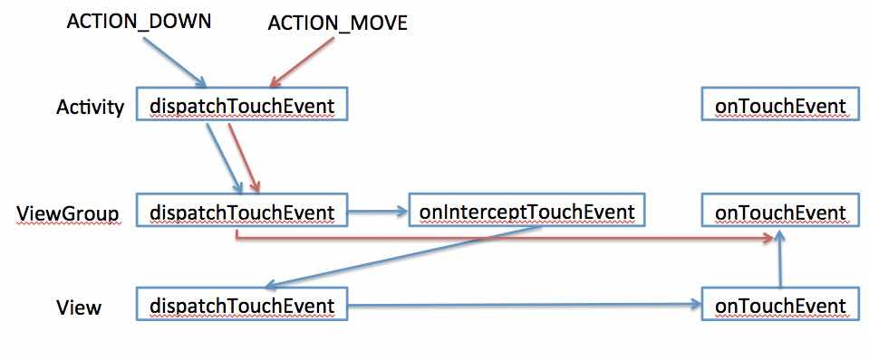

跟touch事件相关的3个方法：

	public boolean dispatchTouchEvent(MotionEvent ev);    //用来分派event
	public boolean onInterceptTouchEvent(MotionEvent ev); //用来拦截event
	public boolean onTouchEvent(MotionEvent ev);          //用来处理event
	
拥有这三个方法的类：

	Activity类：	Activity	
	dispatchTouchEvent(); 
	onTouchEvent();
	
	View容器（ViewGroup的子类）：FrameLayout、LinearLayout…… ListView、ScrollVIew……	dispatchTouchEvent();
	onInterceptTouchEvent();
	onTouchEvent();
	
	View控件（非ViewGroup子类）：Button、TextView、EditText…
	dispatchTouchEvent();
	onTouchEvent();
	
三个方法的用法：

	dispatchTouchEvent()	用来分派事件。
	其中调用了onInterceptTouchEvent()和onTouchEvent()，一般不重写该方法

	onInterceptTouchEvent()	用来拦截事件。
	ViewGroup类中的源码实现就是{return false;}表示不拦截该事件，
	事件将向下传递（传递给其子View）；
	若手动重写该方法，使其返回true则表示拦截，事件将终止向下传递，
	事件由当前ViewGroup类来处理，就是调用该类的onTouchEvent()方法

	onTouchEvent()	用来处理事件。
	返回true则表示该View能处理该事件，事件将终止向上传递（传递给其父View）；
	返回false表示不能处理，则把事件传递给其父View的onTouchEvent()方法来处理
	【注】：ViewGroup的某些子类（GridView、ScrollView...）重写了onInterceptTouchEvent()方法，当发生ACTION_MOVE事件时，返回true进行拦截。
	
具体示意图

viewgroup消耗了该事件，随后的action_move和up事件直接传给了该viewgroup

具体流程说明

	（1）这一系列的传递流程都是dispatchTouchEvent()方法来控制的，如果不人为地干预，事件将由上自下依次传递（因为默认是返回false不会拦截的），传递到最底层的View，就由它的onTouchEvent()方法来处理事件，若处理成功返回true，若处理失败返回false，事件依次向上传递，每个View都调用自己的onTouchEvent()方法来处理事件，若处理成功就终止传递，若处理失败就继续向上传递。
	（2）经过人为的干预，若在向下传递的过程中被拦截了，即onInterceptTouchEvent()方法返回true，则事件将停止向下传递，直接由当前的onTouchEvent()方法来处理，若处理成功则OK，若处理不成功，则事件会向上传递。
	（3）另外，dispatchTouchEvent()方法中还有“记忆”的功能，如果第一次事件向下传递到某View，它把事件继续传递交给它的子View，它会记录该事件是否被它下面的View给处理成功了，（怎么能知道呢？如果该事件会再次被向上传递到我这里来由我的onTouchEvent()来处理，那就说明下面的View都没能成功处理该事件）；当第二次事件向下传递到该View，该View的dispatchTouchEvent()方法机会判断，若上次的事件由下面的view成功处理了，那么这次的事件就继续交给下面的来处理，若上次的事件没有被下面的处理成功，那么这次的事件就不会向下传递了，该View直接调用自己的onTouchEvent()方法来处理该事件。
	（4）“记忆”功能的信息只在一系列事件完成之前有效，如从ACTION_DOWN事件开始，直到后续事件ACTION_MOVE，ACTION_UP结束后，“记忆”的信息就会清除。也就是说如果某View处理ACTION_DOWN事件失败了（onTouchEvent()返回false），那么后续的ACTION_MOVE,ACTION_UP等事件就不会再传递到该View了，由其父View自己来处理，直接发送到父view的onTouchEvent，不会经过父view的onInterceptTouchEvent，但是还是会经过父view的dispatchTouchEvent，父view的父view的onInterceptTouchEvent依然可以拦截后续的ACTION_MOVE，ACTION_UP，拦截后父view会收到ACTION_CANCEL事件。在下一次发生ACTION_DOWN事件的时候，还是会传递到该View的。
	
还有一个ACTION_CANCEL事件

官方文档讲的是当前手势被释放，你将不会接收到其他的事件，应该向ACTION_UP一样对待它，ACTION_CANCEL事件是收到前驱事件后，后续事件被父控件拦截的情况下产生，onTouchEvent的事件回传到父控件只会发生在ACTION_DOWN事件中