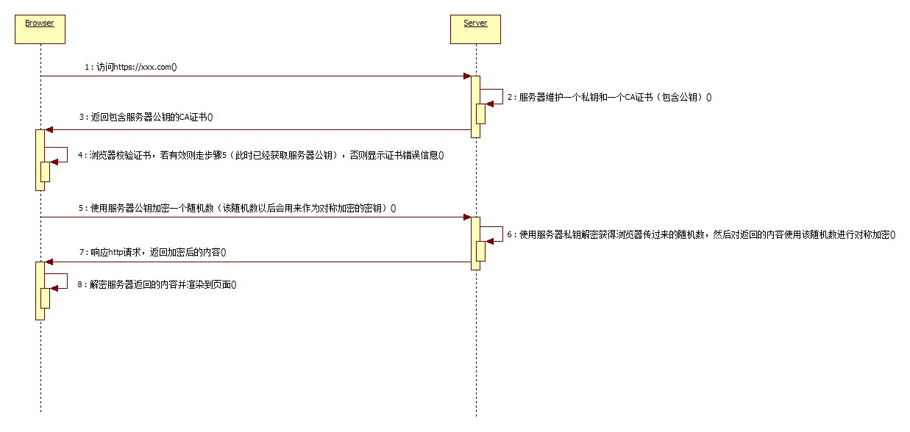

简要介绍下HTTPS

HTTPS使用端口443，HTTPS和TCP/IP层之间加入了SSL层HTTP直接使用端口80和TCP/IP层通信

整个https流程实际上是： 使用非对称加密算法保证对称加密密钥的安全传递，然后使用对称加密来保证数据传输过程中的安全性，总体时序图如下

CA证书是由权威机构颁发（由浏览器自动去权威机构验证，意味着你可以信任他），证书的内容包含多种信息，其中就包括服务器的公钥，还包括证书有效期等等。 
通过它建立我们的信任基点，就可以保证服务器公钥被正确的传递给浏览器，然后浏览器可以使用它安全的把对称加密的密钥传递给服务器，之后以此密钥加密需要传递的信息，保证了数据的安全性.
非对称加密的计算效率远远不如对称加密