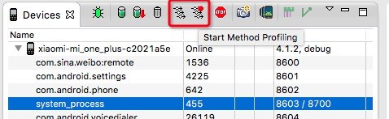
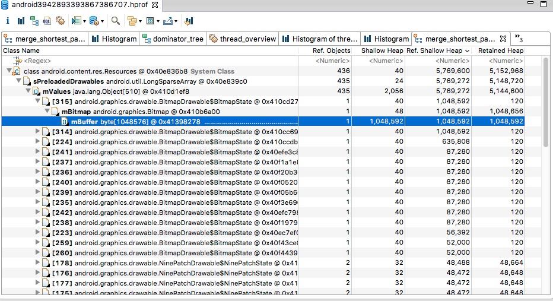
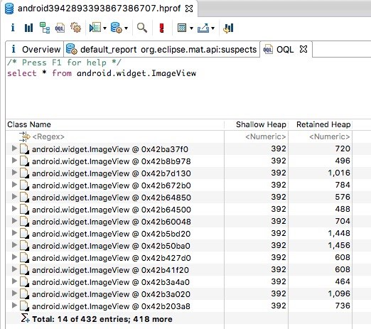

介绍几种Android工具
1、应用流畅度检测 Gpu Rendering
2、查找耗时操作 Method Profiling
3、内存溢出检测 Memory Profilers，MAT

官网文档http://developer.android.com/tools/performance/index.html

1、应用流畅度检测

官方文档http://developer.android.com/tools/performance/profile-gpu-rendering/index.html

可以通过开发模式的gpu呈现模式数据 adb shell dumpsys gfxinfo packagename
	首先得在开发者选项打开
	
	adb shell dumpsys gfxinfo com.facebook.katana > facebook.txt
可以通过excel生成相应的图表，也可以以条状图的形式展示。

2、查找耗时操作

Method Profiling工具，查看具体方法的调用次数，cpu占用，耗时等信息。查找可能存在的瓶颈

3、内存溢出检测

官方文档http://developer.android.com/tools/performance/comparison.html

dump出来的.hprof文件可以通过eclipse的mat插件查看。
可通过如下方法安装
Eclipse - >help - > Eclipse Marketplace 找到Memory Analyzer安装。

如下图的byte数据，可以通过在mBuffer上右键->copy->Save Value To File保存到本地，比如保存为bitmap.data，然后通过[GIMP](http://www.gimp.org/)来打开查看

其中的OQL标签页是一个可支持sql语句的查询界面，其中的红色叹号是执行按钮，可以用来查询自己怀疑和感兴趣的位置

